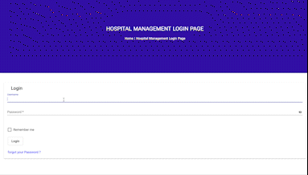
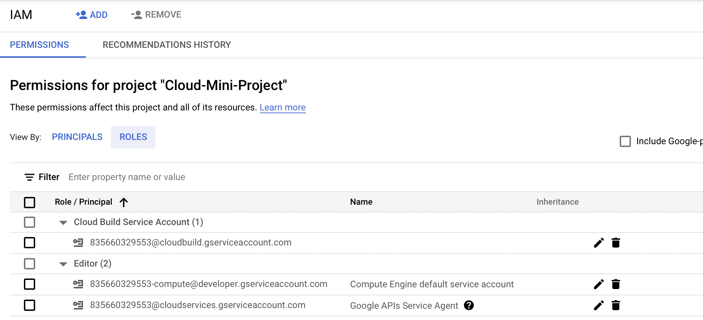
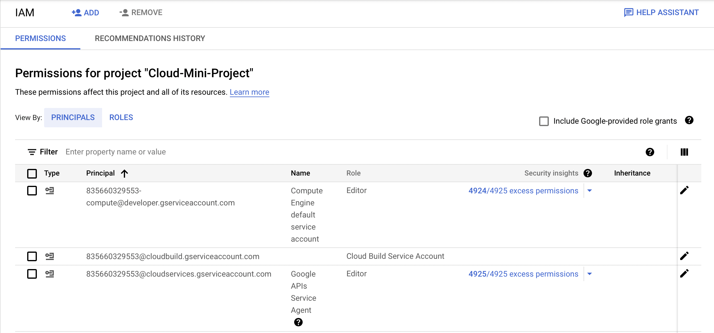

# Appointment-Management-API
<p align="center">
  
</p>

This project is developed as a part of coursework for Cloud Computing taught by [Dr. Sukhpal Singh Gill]. We have developed REST API and have deployed our application on cloud using docker and kubernetes.

We have implemented following points as the part of coursework: 
- REST API with proper status code
- Integration with external API
- Cloud based Database
- Load balancing using GKE cluster
- Implementing hash-based authentication
- Implementing user accounts and access management
- Securing the database with role-based policies

## Table of Contents
- [About](#about)
- [System Architecture](#system-architecture)
- [Backend](#backend)
  - [CRUD Operations](#crud-operations)
  - [Cloud Deployment](#cloud-deployment)
    - [Google Cloud](#google-cloud)
  - [Running Locally](#running-locally)
    - [Local Node.js Installation](#local-node-installation)
 - [Front-end](#front-end)
 - [Conclusion](#conclusion)
# About
This application is created for managing appointments in hospitals, it can further be used in all the different kind of applications where we need to schedule meetings between two users and gather feedback.Our main focus is to collaborate doctors and patients across the region on one platform and patients can get online consulation using our platform. Currently we have developed API's to add, edit, get and delete patients and doctors in the platform.

# Note
This platform can be used as an POC and others features can be developed later on based on the use case.This platform will be developed using agile methodology and can be further divided into stages.The current version is more focused on backend API's using Nodejs with CRUD operations for patients, doctors and platform users. 

We have also used <b>api.1up.health</b> external api to get the list of hospitals and doctors.Security mechanisms are implemented in the project by using salt and hash based authenticatin. We have also implemented session management for the user.Currently the backend service is deployed on Cloud using docker and kubernetes. Also you can access the backend locally using the guide mention below.

## System Architecture

<p align="center">
  
</p>

The front-end is developed using angular library and is compatible with all browser versions and it is also responsive on mobile screens as well.
The backend is a REST-based service interface for CRUD operations (for example, user sign up & login, CRUD operations on doctor and patient like POST, PUT) deployed via Google Cloud to facilitate scalable performance with Kubernetes of our dockerized image. The node server interacts with api.1up.health API. We have use an extranl NoSQL database i.e MongoDB which is hosted on cloud to store information about patients, users of the system and doctors. Since this is the microservice we can design multiple rest based API using different programming language like python, java, etc to make our application seamless. Adding other languages wont affect the system design and this in turn will make our system robust.


## Backend
We have used Nodejs to build our backend application using express framework. It is advisable to use [Postman](https://www.postman.com/) to test the CRUD operations when accessing the backend.The CRUD operations are explained in detail in the next section.Backend code is available in the server folder with all the subfolders for code management and readability purpose.

### CRUD Operations

### Cloud App

The project is deployed on GCP cloud using docker and the application is also load balanced using Kubernetes.

Following steps can be followed to deploy our project on cloud.
__Note:__ : You will need a gcp account to follow the steps. Link to Create an account can be found here [GCP](https://cloud.google.com/gcp/). Also once you login into GCP you need to create a project and keep a note of projectId for further steps

##### Pre-Deployment

First, launch the cloud shell and clone the repository by:
``` 
git clone https://github.com/shalini1153/Appointment-Management-API.git
```
Navigate into the repository by typing 
```
cd Appointment-Management-System
```
Project Id can be verified using the command ``gloud projects list``

Also set the PROJECT_ID variable with your GCP project Id using below command
```
export PROJECT_ID= PROJECT_ID
```
Now you can create a docker image of your code using the following command. __Note__: You need Dockerfile in your code repo to execute this command. Sample can be found in server folder.
```
docker build -t ${PROJECT_ID}/appointment:v1 .
```
After executing the command you can check your image using the command 

```
docker images
```
##### After creating an image we need to push it to GCP Container Registry
You will have to enable [Container Registry API](https://console.cloud.google.com/apis/library/containerregistry.googleapis.com) and also you will need to create an artifact in here [Artifact Registry API](https://cloud.google.com/artifact-registry). You will also need to enable API access and add roles to your user to access the above mentioned registry.

 &nbsp;&nbsp;&nbsp;&nbsp; &nbsp;&nbsp;  

To push image to GCP use below command:
Now we push the image
```
docker push gcr.io/${PROJECT_ID}/appointment:v1
```
Next Step is to create a GKE cluster on GCP. Creating the deployment
```
kubectl create appointment-management --image=gcr.io/${PROJECT_ID}/appointment:v1
```
We have created 3 replica sets to load balance or to three deployment replicas
```
kubectl scale deployment appointment-management --replicas=3
```
Checking if our pods are created successfully:
```
kubectl get pods
```
#### Exposing our application to INTERNET
In our case, we require port 3000, as our development .env file contains information to connect to MongoDB set to port 3000.

```
kubectl expose deployment appointment-management --name=appointment-management-service --type=LoadBalancer --port 3000 --target-port 3000
```

Verify that the services are running :
```
kubectl get service
```
Attached screenshot of the clusters created using kubernetes


It takes time to deploy our service so the intial state will be ``<pending>``. 

#### Delete the Service,  Cluster & Images
If you are done testing our educational application you may follow these steps:
```
kubectl delete service appointment-management-service
```
```
gcloud container clusters delete appointment-management-appointment-management --zone europe-west1-b
```
```
gcloud container images delete gcr.io/${PROJECT_ID}/appointment:v1  --force-delete-tags --quiet
```
### Running Locally

You can follow below steps to run the application locally
```
npm install
```
```
npm run start
```
The application will be running on http://localhost:3000

## Front-end
The current version of the front-end is being developed using angular and can run locally.[Node.js](https://nodejs.org/en/) is required alongside with the respective Node version.

To launch the front end, navigate into the front-end folder of the repository. 
```
cd client
```

Install dependencies.
```
npm install
```

Start the front-end node.js server by typing:
```
npm start
```

## Conclusion
This project uses REST API protocols and has basic CRUD operations for doctor and patient.The current application is also deployed on GCP cloud using docker and kubernetes. We have also integrated external API to enhance our application.Role and permission managament is done on GCP cloud to access different resources on the cloud. Sensitive information like user password is hashed using salt and hash based algorith using bcrypt. We have also added user and roles on database for security reasons.
This project is part of a cloud computing coursework taught by [Dr. Sukhpal Singh Gill]((https://github.com/iamssgill)) at the Queen Mary University of London Electrical Engineering & Computer Science Department to create a prototype of a cloud application.

