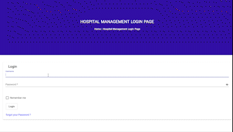

# Appointment-Management-API

  

This project is developed as a part of coursework for Cloud Computing taught by [Dr. Sukhpal Singh Gill]. We have developed REST API and have deployed our application on cloud using docker and kubernetes

## Table of Contents
- [About](#about)
- [System Architecture](#system-architecture)
- [Backend](#backend)
  - [CRUD Operations](#crud-operations)
  - [Cloud Deployment](#cloud-deployment)
    - [Google Cloud](#google-cloud)
  - [Running Locally](#running-locally)
    - [Local Node.js Installation](#local-node-installation)
    - [Docker Container](#docker-container)
 - [Front-end](#front-end)
 - [Conclusion](#conclusion)
# About
This application is created for managing appointments in hospitals, it can further be used in all the different kind of applications where we need to schedule meetings between two users and gather feedback.Our main focus is to collaborate doctors and patients across the region on one platform and patients can get online consulation using our platform. Currently we have developed API's to add, edit, get and delete patients and doctors in the platform.

# Note
This platform can be used as an POC and others features can be developed later on based on the use case.This platform will be developed using agile methodology and can be further divided into stages.The current version is more focused on backend API's using Nodejs with CRUD operations for patients, doctors and platform users. 

We have also used <b>api.1up.health</b> external api to get the list of hospitals and doctors.Security mechanisms are implemented in the project by using salt and hash based authenticatin. We have also implemented session management for the user.Currently the backend service is deployed on Cloud using docker and kubernetes. Also you can access the backend locally using the guide mention below.

## System Architecture

  

The front-end is developed using angular library and is compatible with all browser versions and it is also responsive on mobile screens as well.
The backend is a REST-based service interface for CRUD operations (for example, user sign up & login, CRUD operations on doctor and patient like POST, PUT) deployed via Google Cloud to facilitate scalable performance with Kubernetes of our dockerized image. The node server interacts with api.1up.health API. We have use an extranl NoSQL database i.e MongoDB which is hosted on cloud to store information about patients, users of the system and doctors. Since this is the microservice we can design multiple rest based API using different programming language like python, java, etc to make our application seamless. Adding other languages wont affect the system design and this in turn will make our system robust.

## Backend
We have used Nodejs to build our backend application using express framework. It is advisable to use [Postman](https://www.postman.com/) to test the CRUD operations when accessing the backend.The CRUD operations are explained in detail in the next section.Backend code is available in the server folder with all the subfolders for code management and readability purpose.

### CRUD Operations

### Cloud App

The project is deployed on GCP cloud using docker and the application is also load balanced using Kubernetes.

Following steps can be followed to deploy our project on cloud.
__Note:__ : You will need a gcp account to follow the steps. Link to Create an account can be found here [GCP](https://cloud.google.com/gcp/). Also once you login into GCP you need to create a project and keep a note of projectId for further steps

